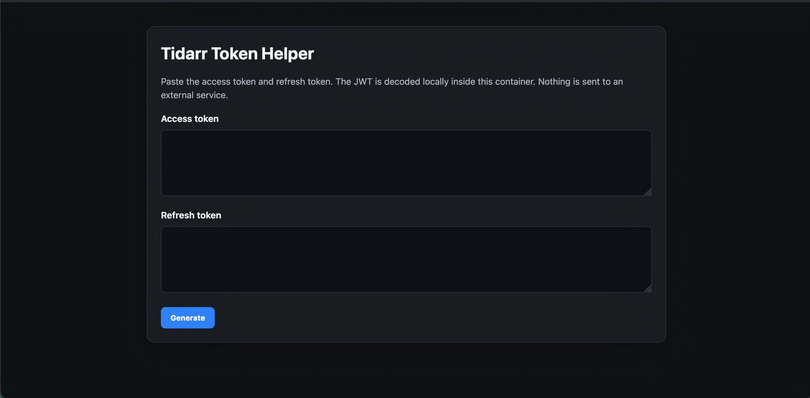
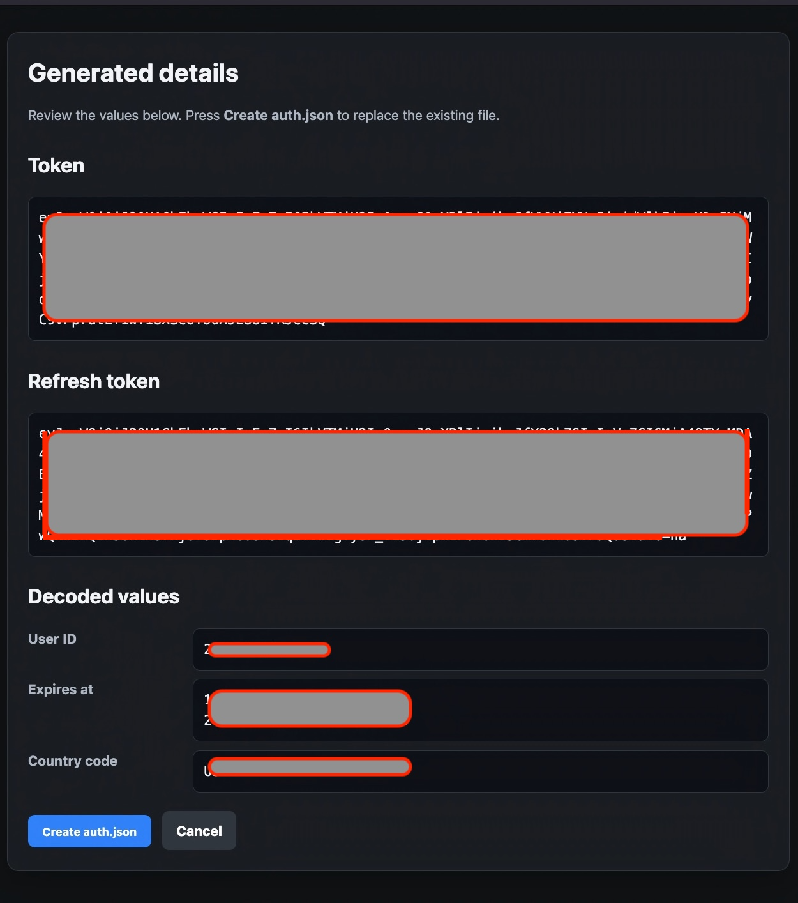
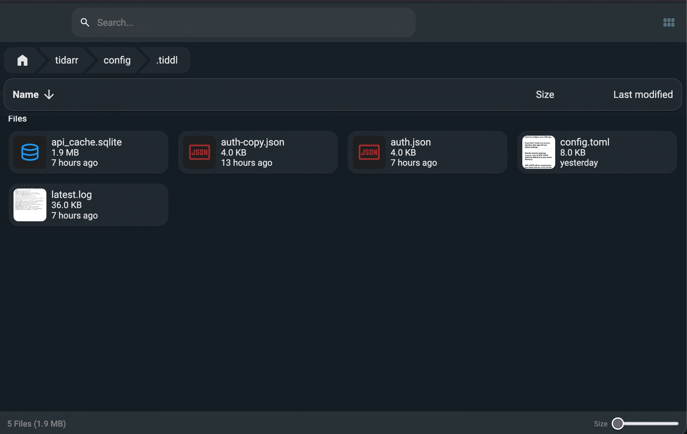

# Tidarr Token Helper

A small self-hosted web interface that decodes an access-token JWT locally and creates the `auth.json` file used by Tidarr/Tiddl.

> This project is not affiliated with TIDAL, Tidarr, or Tiddl.

## Disclaimer
This project created for educational purposes you are responsible 
on how or why you use it. please follow the jurisdiction/rules and guidelines of your country

## Features

- Access-token and refresh-token input fields
- Local JWT payload decoding
- Review page before writing the file
- Atomic creation or replacement of `auth.json`
- Generated file permissions set to `0600`
- Configurable container UID:GID
- Browser login using HTTP Basic Authentication
- Docker health check
- Prebuilt AMD64 and ARM64 image from GitHub Container Registry

The generated file uses this format:

```json
{"token":"12345","refresh_token":"12345","expires_at":"12345","user_id":"12345","country_code":"US"}
```

## Screenshots









## Container image

Stable pinned release:

```text
ghcr.io/foreignwelcome/tidarr-token-helper:v1.0.0
```

Newest stable release:

```text
ghcr.io/foreignwelcome/tidarr-token-helper:latest
```

The supplied `compose.yaml` uses the pinned `v1.0.0` image. Change the tag deliberately when you choose to update.

## Install with Arcane on TrueNAS SCALE

### 1. Create a project

Create a new Arcane project and paste the supplied `compose.yaml`.

### 2. Edit the required values

Change the browser password:

```yaml
APP_PASSWORD: "change-this-password-before-deploy"
```

Set your timezone:

```yaml
TZ: "Etc/UTC"
```

Set the UID:GID that should own `auth.json`:

```yaml
user: "568:568"
```

TrueNAS SCALE commonly uses `568:568` for the `apps` user, but verify your own Tidarr installation:

```bash
sudo docker exec <tidarr-container-name> id
```

Or inspect the destination directory:

```bash
stat -c '%u:%g %n' /mnt/<pool-name>/<path-to-tidarr-config>/.tiddl
```

### 3. Set the output path

For a safe test, the Compose file uses:

```yaml
source: ./output
```

For the real Tidarr file, replace it with the host path to Tidarr's `.tiddl` directory:

```yaml
volumes:
  - type: bind
    source: /mnt/<pool-name>/<path-to-tidarr-config>/.tiddl
    target: /output
```

Prepare that directory with the same UID:GID configured in `user:`:

```bash
sudo mkdir -p /mnt/<pool-name>/<path-to-tidarr-config>/.tiddl
sudo chown <uid>:<gid> /mnt/<pool-name>/<path-to-tidarr-config>/.tiddl
sudo chmod 770 /mnt/<pool-name>/<path-to-tidarr-config>/.tiddl
```

Do not use recursive `chown -R` unless you intentionally want to change everything below that path.

### 4. Deploy and open

Deploy the project, then open:

```text
http://<your-truenas-ip>:8788
```

## Install with normal Docker Compose

Create a directory:

```bash
mkdir -p tidarr-token-helper/output
cd tidarr-token-helper
```

Save the supplied Compose configuration as `compose.yaml`.

Edit:

- `APP_PASSWORD`
- `TZ`
- `user: "<uid>:<gid>"`
- The volume source

For a normal Linux account, find the UID and GID with:

```bash
id -u
id -g
```

For the default `./output` test directory:

```bash
sudo chown <uid>:<gid> output
chmod 700 output
```

Start the service:

```bash
docker compose up -d
```

Open:

```text
http://<your-server-ip>:8788
```

Check status:

```bash
docker compose ps
docker compose logs -f
```

## Updating

Pinned-version users should change the image tag, for example:

```yaml
image: ghcr.io/foreignwelcome/tidarr-token-helper:v1.0.1
```

Then run:

```bash
docker compose pull
docker compose up -d
```

Users following `latest` can run the same two commands to retrieve the newest stable image.

## Build from source

Contributors can clone the repository and build locally:

```bash
git clone https://github.com/ForeignWelcome/Tidarr-Token-Helper.git
cd Tidarr-Token-Helper

docker build -t tidarr-token-helper:local .
```

No `requirements.txt` is needed because the application uses only Python's standard library.

## Publishing a release

The workflow publishes:

```text
ghcr.io/foreignwelcome/tidarr-token-helper:v1.0.0
ghcr.io/foreignwelcome/tidarr-token-helper:latest
```

Pre-releases receive their version tag but do not replace `latest`.

## Security

Read [SECURITY.md](SECURITY.md). Keep this service on a trusted local network and change the default browser password before deployment.

## License

MIT License. See [LICENSE](LICENSE).
